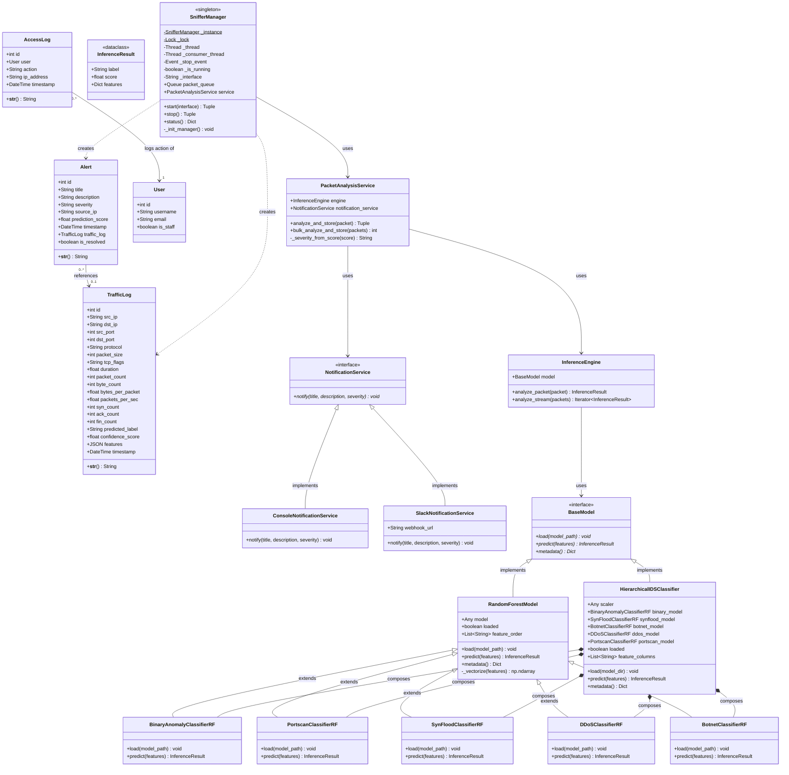

# Network Intrusion Detection System (NIDS) - UML Class Diagram

This document presents a comprehensive UML Class Diagram representing the architecture of the **Sentinel Flow NIDS** backend. The system is designed with a decoupled architecture, separating database persistence, machine learning inference, real-time packet capturing, and event notifications.

---

## 1. Class Diagram (Mermaid)

The diagram below details the classes, attributes, methods, and relationships of the system.

---

## 2. Component Breakdowns

### A. Django Database Models
*   **TrafficLog**: Represents detailed statistical features extracted from captured packets. Fields include networking parameters (IPs, ports, protocols, size, TCP flags) and classification results (predicted label and confidence score).
*   **Alert**: Generated when the ML Inference Engine classifies a packet as an attack. Features a foreign key association to the corresponding `TrafficLog` to retain full forensic context.
*   **AccessLog**: Records authentication attempts (`LOGIN`/`LOGOUT`) by system `User`s for audit logging and Role-Based Access Control (RBAC) security purposes.

### B. Machine Learning (ML) Inference Pipeline
*   **BaseModel**: An abstract base class defining the uniform contract for all model wrappers (`load`, `predict`, and `metadata`).
*   **RandomForestModel**: Concrete adapter wrapping the scikit-learn Random Forest model, managing data vectorization and prediction logic.
*   **HierarchicalIDSClassifier**: Composite classifier managing the two-tier inference logic using the scaler and individual specialized models.
*   **The 5 Random Forest Classifiers**: Specialized instances of the Random Forest model used for hierarchical classification:
    *   `BinaryAnomalyClassifierRF`: Decides if a packet is Normal or Intrusion.
    *   `PortscanClassifierRF`: Classifies Portscan intrusion signatures.
    *   `SynFloodClassifierRF`: Classifies SYN Flood DDoS signatures.
    *   `DDoSClassifierRF`: Classifies general DDoS traffic anomalies.
    *   `BotnetClassifierRF`: Classifies Botnet communication signatures.
*   **InferenceEngine**: Bridges feature extraction and model prediction by converting raw packet packets to normalized features and feeding them to the active model.
*   **PacketAnalysisService**: Orchestrates the workflow: passes incoming packets to the `InferenceEngine`, saves the resulting `TrafficLog` and `Alert` records, and dispatches external notifications if an attack is identified.

### C. Notification Subsystem
*   **NotificationService**: Interface declaring the unified `notify` method.
*   **ConsoleNotificationService**: Standard local logger sending severe security events directly to the logs/console.
*   **SlackNotificationService**: Remote hook dispatching critical alert payloads directly to a dedicated Slack security channel.

### D. Sniffing & Queueing Engine
*   **SnifferManager**: A Singleton class implementing a thread-safe producer-consumer model:
    1.  **Producer (Scapy thread)**: Sniffs packets on the network interface and pushes them to a thread-safe `Queue`.
    2.  **Consumer (Worker thread)**: Dequeues packets in batches (default: 50 packets) and passes them to `PacketAnalysisService.bulk_analyze_and_store` to guarantee high-performance, low-latency database insertions.
